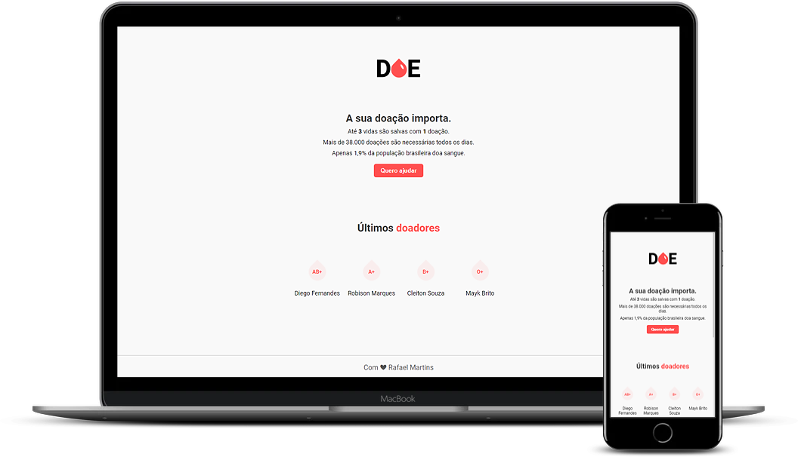

<h1 align="center">
  

</h1>

<p align="center"> :two_hearts: A sua doação importa!</p>

<p align="center">
  
  
  
  <a href="https://github.com/martins-rafael/Doe/commits/master">
    
  </a>
  <a href="https://opensource.org/licenses/MIT">
    
  </a>
</p>

<p align="center">
  <a href="#rocket-tecnologias">Tecnologias</a>&nbsp;&nbsp;&nbsp;|&nbsp;&nbsp;&nbsp;
  <a href="#computer-projeto">Projeto</a>&nbsp;&nbsp;&nbsp;|&nbsp;&nbsp;&nbsp;
  <a href="#wrench-instalação-e-uso">Instalação e uso</a>&nbsp;&nbsp;&nbsp;|&nbsp;&nbsp;&nbsp;
  <a href="#memo-licença">Licença</a>
</p>

<br>

<div align="center">
  
</div>

<br>

## :rocket: Tecnologias

As seguintes tecnologias foram utilizadas no desenvolvimento do projeto:

- [HTML](https://devdocs.io/html/)
- [CSS](https://devdocs.io/css/)
- [Javascript](https://devdocs.io/javascript/)
- [Node.JS](https://nodejs.org/en/)
- [PostgreSQL](https://www.postgresql.org/)

<br>

## :computer: Projeto
O Doe é uma aplicação web para cadastrar doações de sangue, desenvolvido durante a MaratonaDev 3.0 da [Rocketseat](https://rocketseat.com.br/).

<div align="center">
  
</div>

<br>

## :wrench: Instalação e uso

Para rodar a aplicação, você precisa ter instalado em sua máquina o [Node](https://nodejs.org/en/), o [Postgres](https://www.postgresql.org/) e o [Postbird](https://www.electronjs.org/apps/postbird).

Siga os passos abaixo:

1) Abra um terminal e copie este repositório com o comando
    ```
    git clone https://github.com/martins-rafael/doe.git
    ```
    ou use a opção de download.

2) Entre na pasta com
    ```
    cd doe
    ```

3) Instale as dependências
    ```
    npm install
    ```

4) Utilizando a ferramenta Postbird, crie o banco de dados "doe" **através da query** ```CREATE DATABASE doe```. Agora crie a tabela com o nome de **donors** que possua os seguintes campos:
- name: TEXT e NOT NULL;
- email: TEXT e NOT NULL;
- blood: TEXT e NOT NULL;

5) Para configurar a conexão com o banco de dados, abra o arquivo ```server.js``` dentro da pasta ```src``` e edite a **linha 18** com o password cadastrado durante a instalação do Postgres.
```js
    // conexão com banco de dados
    const { Pool } = require('pg')
    const db = new Pool({
      user: 'postgres', // default user
      password: '0000', // altere com sua senha do postgres
      host: 'localhost',
      port: 5432,
      database: 'doe'
    })
```

6) Rode a aplicação:
    ```
    npm start
    ```

7) Acesse ```http://localhost:3000``` no seu navagador.

<br>

## :memo: Licença

Esse projeto está sob a licença MIT. Veja o arquivo [LICENSE](/LICENSE) para mais detalhes.

---

Feito com :purple_heart: by [Rafael Martins](https://github.com/martins-rafael)