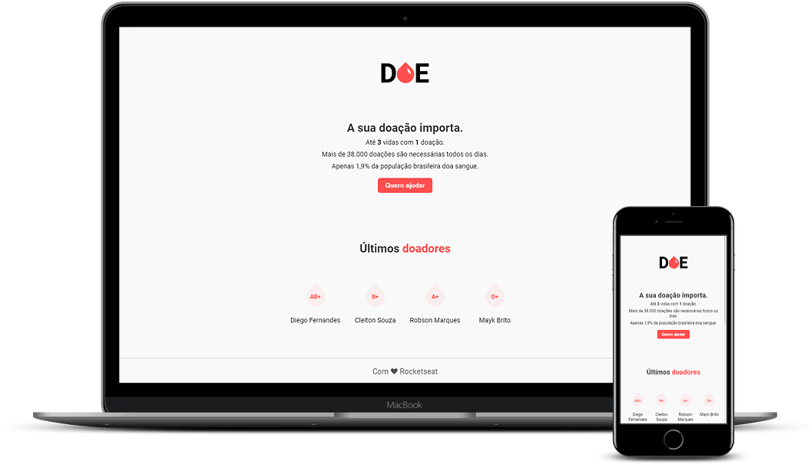
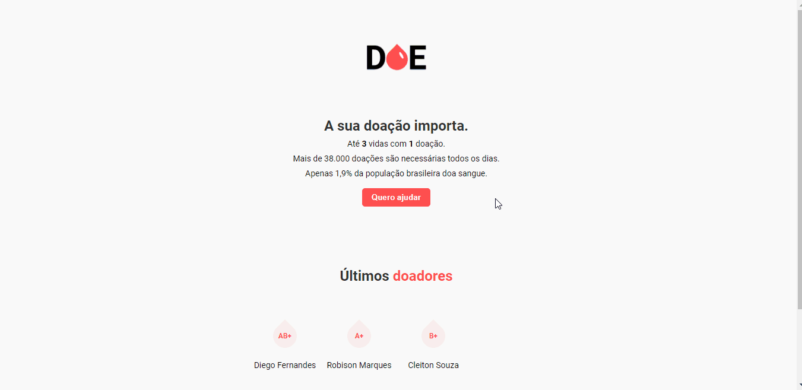

<h1 align="center">
  

</h1>

 :rocket: Site de doação de sangue, desenvolvido durante a MaratonaDev 3.0 da Rocketseat.

  
  
  
  

 

  

## :clapper: Demo
O GIF abaixo mostra o site em ação:

  

## :computer: Tecnologias
- [HTML](https://devdocs.io/html/)
- [CSS](https://devdocs.io/css/)
- [Javascript](https://devdocs.io/javascript/)
- [Node.JS](https://nodejs.org/en/)
- [Nodemon](https://nodemon.io/)
- [Nunjucks](https://mozilla.github.io/nunjucks/)
- [PostgreSQL](https://www.postgresql.org/)

## :memo: Licença

Esse projeto está sob a licença MIT. Veja o arquivo [LICENSE](/LICENSE) para mais detalhes.
